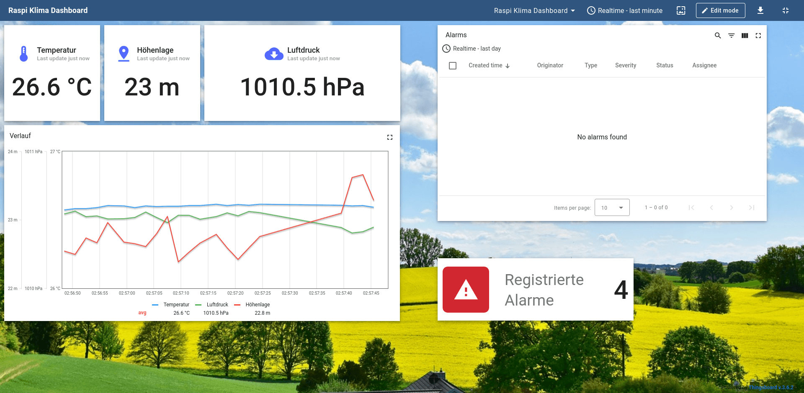
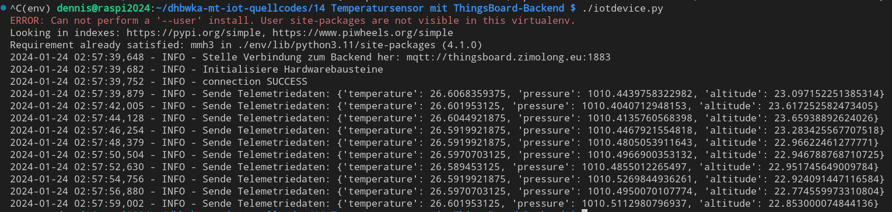
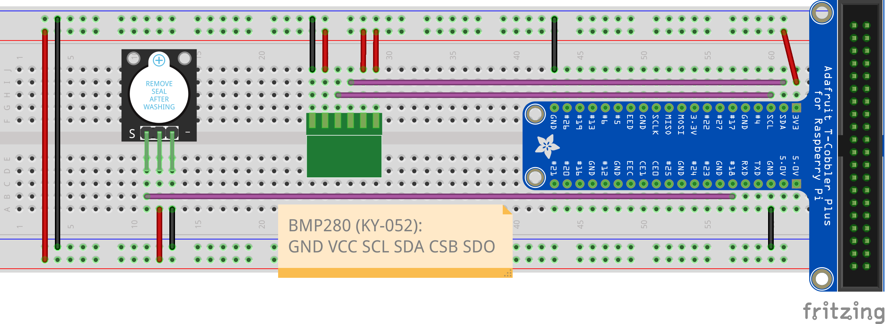

Temperaturesensor mit ThingsBoard-Backend
=========================================

Dieses Beispiel zeigt eine einfache IoT-Anwendung, die regelmäßig einen am Raspberry Pi
angeschlossenen Umweltsensor ausliest und die Werte an ein mit [ThingsBoard](https://thingsboard.io)
realisiertes IoT-Backend sendet. ThingsBoard speichert die Daten als Zeitreihen in einer
Datenbank, löst Alarm aus, wenn die Werte im kritischen Bereich liegen und visualisiert
diese in einem Dashboard.

Hinweise zur Nutzung
-------------------

Für dieses Beispiel wurde ein eigener ThingsBoard-Server unter [https://thingsboard.zimolong.eu](https://thingsboard.zimolong.eu)
aufgesetzt. Zugangsdaten erhalten Sie in der Vorlesung bzw. auf Nachfrage per E-Mail.

Damit das Beispiel funktioniert, muss in ThingsBoard ein neues Device angelegt werden.
Anschließend muss die Datei `.env.vorlage` nach `.env` kopiert und angepasst werden.
Vor allem der Access Token des Devices muss noch eingetragen werden. Anschließend sollte
sich das Python-Programm mit ThingsBoard verbinden und die Daten senden können.

Hardwareaufbau
--------------

Der Hardwareaufbau besteht aus einem BMP280-Umweltsensor (Bauteil KY-052 im Sensor Kit)
und einem Buzzer, der bei Alarm einen Ton erzeugt (Bauteil KY-012). Diese müssen wie folgt
mit dem Raspberry Pi verbunden werden:

 * BMP280-Sensor:
    * GND → Raspberry Pi GND
    * VCC, SDO, CSB → Rasbperry Pi 3.3V
    * SDA → Rasbperry Pi GPIO 2 (SDA1)
    * CCL → Raspberry Pi GPIO 3 (SCL1)
 * Buzzer:
    * S → Raspberry Pi GPIO 18
    * \+ → Raspberry Pi 3.3V
    * \- → Rasbperry Pi GND

