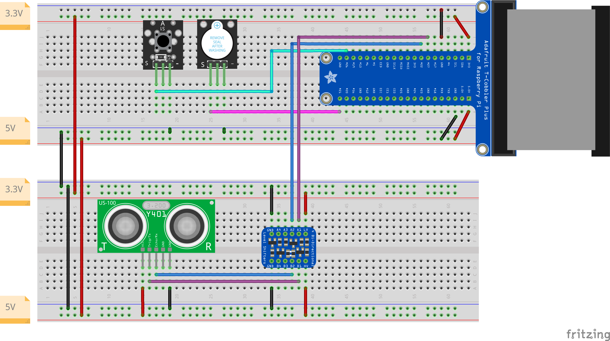

Digital Ein- und Ausgänge
=========================

Dieses Beispiel zeigt einen etwas komplexeren Hardwareaufbau, bei dem wir eine
typische Einparkhilfe, wie man sie vom Auto her kennt, nachbauen. Die Einparkhilfe
wird durch einen elektrischen Kontakt (meist mit dem Rücklicht verbunden) aktiviert
und nimmt daraufhin periodische Abstandsmessungen mit einem Ultraschallsensor vor.
Das Ergebnis wird in ein auditorisches Feedback in Form von unterschiedlich lange
und schnell andauernder Piepstöne eines Buzzers mitgeteilt.

Dank gpiozero ist die Programmierung eigentlich ziemlich leicht, da für alle
Bauteile fertige Klassen genutzt werden können. Lediglich das Ausrechnen der
Häufigkeit und dauer des akkustischen Signals ist etwas umständlich. Das liegt
aber an der Anforderung und nicht an der Hard- oder Software. :-)

Hardwareaufbau
--------------

Der Hardwareaufbau besteht aus einem Button, der den eingelegten Rückwärtsgang simuliert,
einem Buzzer und einem Ultraschall-Abstandssensor. Letzterer muss dabei über einen
Level Shifter verbunden werden, da er mit 5V Pegel arbeitet, der Pi aber nur mit 3,3V.
Davon abgesehen sollte der Aufbau relativ selbsterklärend sein.

