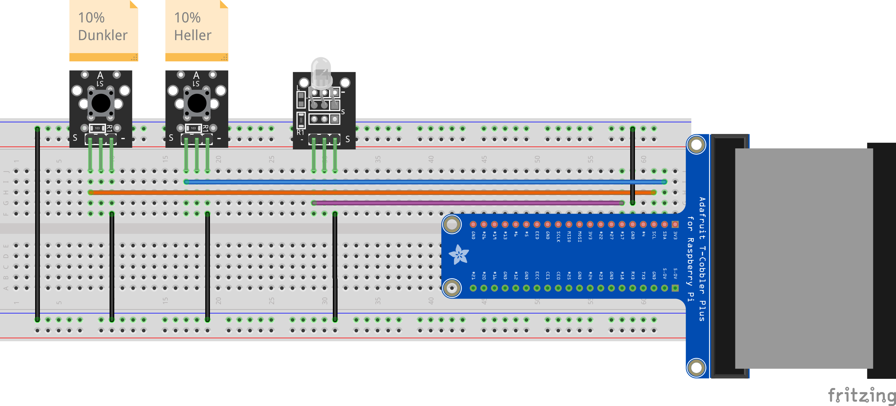

Digital Ein- und Ausgänge
=========================

Dies ist eine Variante des Beispiels zur Ansteuerung digitaler Bausteine.
Wir verwenden hier denselben Hardwareaufbau, jedoch wird die LED durch die
zwei Buttons nicht ein- oder ausgeschaltet, sondern mit PWM in ihrer Helligkeit
reguliert. Die beiden Buttons machen die LED je 10% heller oder dunkler.

Hardwareaufbau
--------------

Der Hardwareaufbau besteht aus zwei Buttons und einer LED. Die LED muss über
einen Vorwiderstand angeschlossen werden, sofern nicht das X40 Sensor Kit
verwendet wird (dort ist auf dem LED-Modul bereits ein Widerstand aufgelötet).

