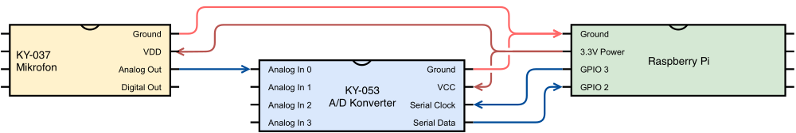
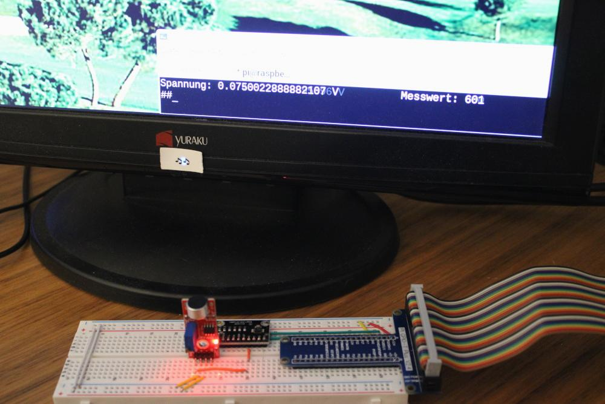
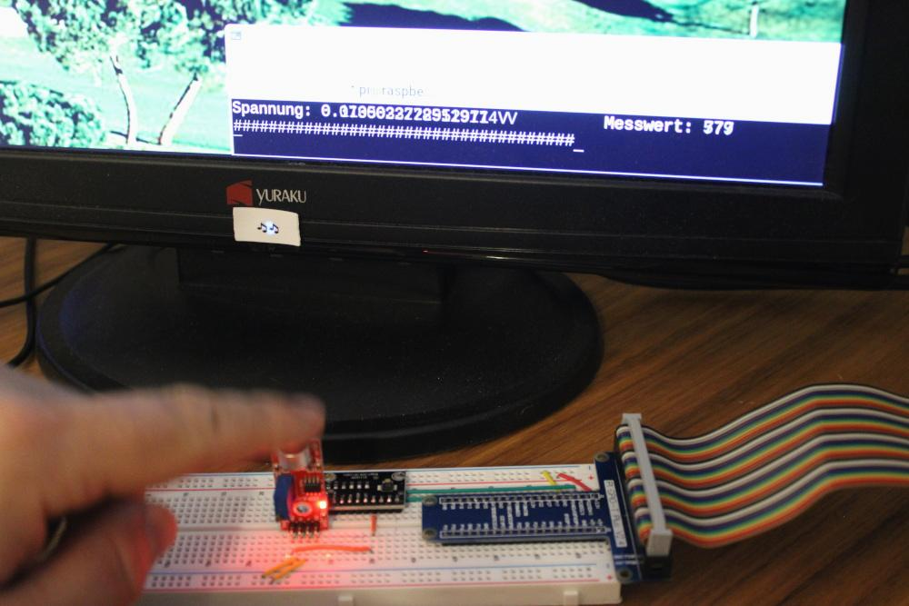

Digital Ein- und Ausgänge
=========================

Der Raspberry Pi kann keine analogen Spannungsverläufe messen oder generieren, da
seine GPIO-Pins rein digital aufgebaut sind. Dieses Beispiel zeigt, wie es mit Hilfe
des ADS1115 A/D-Wandlers aus dem X40 Sensor Kit trotzdem geht. Der Wandler wir hierfür
über eine serielle I²C-Verbindung mit dem Raspberry Pi angeschlossen.

Für die Programmierung kommt hier deshalb nicht gpiozero zum Einsatz, sondern Adafruit
CircuitPython, da letzteres sowohl für die serielle Kommunikation als auch den Sensor
selbst entsprechende Klassen bietet. Im Quellcode müssen daher zwei Objekte verwendet
werden. Die Idee dahinter ist, dass die `busio.I2C`-Klasse den Kommunikationsweg beschreibt
und die `ADC.ADS1115` das Format der auf diesem Weg empfangenen Sensordaten.

Hardwareaufbau
--------------

Als Anwendungsbeispiel wird hier der Signalpegel eines Kleinmembran-Kondensatormikrofons
gemessen, um eine einfache Lautstärkenmessung zu realisieren. Hierfür ist das Mikrofon
an den A/D-Wandler und der A/D-Wandler an den Raspberry Pi angeschlossen.

